# rosa-boundary Architecture

This document describes the system architecture and user flows for rosa-boundary, an access control pattern for ephemeral SRE containers on AWS Fargate.

## Table of Contents

- [Architecture Overview](#architecture-overview)
- [Component Descriptions](#component-descriptions)
- [Investigation Lifecycle](#investigation-lifecycle)
- [Security Model](#security-model)

---

## Architecture Overview

rosa-boundary combines Keycloak (Red Hat build) for OIDC authentication with AWS ECS Fargate for ephemeral SRE workspaces. SREs authenticate via browser-based PKCE flow, assume scoped IAM roles, and connect to isolated containers via ECS Exec.

```mermaid
flowchart TD
    subgraph identity["Identity Plane (OpenShift)"]
        KC["Keycloak (RHBK)"]
        CNPG["CloudNativePG\nPostgreSQL"]
        ESO["ExternalSecrets\nOperator"]
        KC --- CNPG
        ESO -->|fetch credentials| SSMParam
    end

    subgraph client["SRE Workstation"]
        CLI["rosa-boundary CLI\n(Go)"]
        SMP["session-manager-plugin"]
    end

    subgraph aws["AWS Account"]
        subgraph iam["IAM / STS"]
            STS["STS"]
            InvokerRole["Lambda Invoker Role\n(OIDC trust)"]
            SRERole["SRE Shared ABAC Role\n(OIDC trust + session tags)"]
        end

        subgraph control["Control Plane"]
            Lambda["create-investigation\nLambda (Python)"]
            LambdaURL["Lambda Function URL\n(AWS_IAM auth)"]
            EB["EventBridge\nSchedule Rule"]
            Reaper["reap-tasks\nLambda (Python)"]
        end

        subgraph data["Data Plane"]
            ECS["ECS Fargate Cluster\n(Container Insights)"]
            TaskDef["ECS Task Definition\n(per-investigation)"]
            Task["ECS Fargate Task"]
            EFS["EFS Filesystem\n(encrypted)"]
            AP["EFS Access Point\n(per-investigation)"]
            S3["S3 Audit Bucket\n(Object Lock / WORM)"]
        end

        subgraph security["Security Services"]
            KMS["KMS Key\n(ECS Exec encryption)"]
            CW["CloudWatch Logs\n(container + SSM sessions)"]
            SSMParam["SSM Parameter Store\n(Keycloak DB credentials)"]
            SM["Secrets Manager\n(cluster kubeconfigs)"]
        end

        subgraph container["Fargate Task Internals"]
            direction LR
            Main["rosa-boundary container\n(UBI9 + OC 4.14-4.20 +\nAWS CLI + Claude Code)"]
            Proxy["kube-proxy sidecar\n(optional, readonlyRootFilesystem)"]
            Main -->|localhost:8001| Proxy
        end

        subgraph replication["Audit Account (optional)"]
            AuditS3["Cross-Account\nS3 Bucket"]
        end
    end

    CLI -->|"1. OIDC PKCE\n(browser flow)"| KC
    KC -->|"authorization code\n+ id_token"| CLI

    CLI -->|"2. AssumeRoleWithWebIdentity\n(anonymous creds)"| STS
    STS -->|"invoker credentials"| CLI
    STS -.->|validates JWT| InvokerRole

    CLI -->|"3. lambda:InvokeFunction\n(invoker creds)"| Lambda
    Lambda -->|"validate JWT\n(fetch JWKS)"| KC

    Lambda -->|"efs:CreateAccessPoint"| AP
    AP ---|"mounted at\n/{cluster}/{investigation}"| EFS
    Lambda -->|"ecs:RegisterTaskDefinition"| TaskDef
    Lambda -->|"ecs:RunTask + TagResource"| Task
    Lambda -->|"sts:GetCallerIdentity"| STS
    TaskDef -->|"secretsRef"| SM

    CLI -->|"4. AssumeRoleWithWebIdentity\n(anonymous creds)"| STS
    STS -->|"SRE ABAC credentials\n(session tags from JWT)"| CLI
    STS -.->|validates JWT| SRERole

    CLI -->|"5. ecs:ExecuteCommand\n(SRE creds + ABAC)"| Task
    CLI -->|"6. exec syscall"| SMP
    SMP -->|"WebSocket via SSM"| Task

    Task -->|"mount /home/sre"| AP
    Task -->|"S3 sync on exit\n(--no-follow-symlinks)"| S3
    Task -->|"session logs"| CW
    Task -->|"Bedrock API"| Bedrock["Amazon Bedrock\n(Claude models)"]
    Proxy -->|"kubectl proxy"| ROSA["ROSA / OpenShift\nCluster API"]

    EB -->|"rate(15 min)"| Reaper
    Reaper -->|"ecs:ListTasks\necs:DescribeTasks"| ECS
    Reaper -->|"ecs:StopTask\n(deadline exceeded)"| Task

    KMS -.->|"encrypt/decrypt\nexec sessions"| Task
    S3 -->|"cross-account\nreplication"| AuditS3

    style identity fill:#e8f5e9,stroke:#2e7d32,color:#000
    style client fill:#e3f2fd,stroke:#1565c0,color:#000
    style iam fill:#fff3e0,stroke:#e65100,color:#000
    style control fill:#fce4ec,stroke:#c62828,color:#000
    style data fill:#f3e5f5,stroke:#6a1b9a,color:#000
    style security fill:#fff8e1,stroke:#f9a825,color:#000
    style container fill:#e0f2f1,stroke:#00695c,color:#000
    style replication fill:#efebe9,stroke:#4e342e,color:#000
```

### Component Descriptions

| Component | Location | Description |
|-----------|----------|-------------|
| **rosa-boundary CLI** | `cmd/rosa-boundary/`, `internal/` | Go CLI with subcommands for authentication, task lifecycle, and ECS Exec |
| **create-investigation Lambda** | `lambda/create-investigation/` | Python Lambda that validates OIDC tokens, creates EFS access points, registers task definitions, and launches ECS tasks |
| **reap-tasks Lambda** | `lambda/reap-tasks/` | Python Lambda triggered by EventBridge to stop tasks that exceed their deadline |
| **Fargate Container** | `Containerfile`, `entrypoint.sh` | UBI9-based container with OC CLI (4.14-4.20), AWS CLI v2, Claude Code, and S3 audit sync on exit |
| **Keycloak** | `deploy/keycloak/` | RHBK on OpenShift with CloudNativePG, ExternalSecrets for DB credentials from SSM |
| **Terraform** | `deploy/regional/` | All AWS infrastructure: ECS, EFS, IAM, KMS, S3, Lambda, EventBridge, OIDC providers |

### IAM Role Chain

| Role | Trust Principal | Key Permissions | Purpose |
|------|----------------|-----------------|---------|
| **Lambda Invoker** | OIDC providers (web identity) | `lambda:InvokeFunction` (single function) | SREs assume this to call the create-investigation Lambda |
| **SRE Shared (ABAC)** | OIDC providers (web identity + `sts:TagSession`) | `ecs:ExecuteCommand` (ABAC-scoped), `ecs:Describe/List`, `ssm:StartSession`, `kms:Decrypt` | SREs assume this for ECS Exec; ABAC ensures users can only exec into their own tasks |
| **Lambda Execution** | Lambda service | ECS task management, EFS access point management, `iam:PassRole` | create-investigation Lambda runtime permissions |
| **ECS Task Execution** | ECS service | ECR pull, CloudWatch Logs, Secrets Manager read | ECS agent pulls images and injects secrets |
| **ECS Task** | ECS service | S3 `PutObject` (audit), Bedrock `InvokeModel`, SSM messages, CloudWatch Logs, KMS | Container runtime permissions |
| **Reaper Lambda** | Lambda service | `ecs:ListTasks`, `ecs:DescribeTasks`, `ecs:StopTask` (conditioned on `deadline` tag) | Periodic task timeout enforcement |

---

## Investigation Lifecycle

The diagram below shows the complete lifecycle of an investigation: authentication, task creation, usage, timeout enforcement, manual stop, and cleanup.

```mermaid
sequenceDiagram
    actor SRE as SRE User
    participant CLI as rosa-boundary CLI
    participant KC as Keycloak
    participant STS as AWS STS
    participant Lambda as create-investigation<br/>Lambda
    participant ECS as ECS Fargate
    participant EFS as EFS
    participant SM as Secrets Manager
    participant Task as Fargate Task<br/>(Container)
    participant SMP as session-manager-plugin
    participant S3 as S3 Audit Bucket
    participant EB as EventBridge
    participant Reaper as reap-tasks Lambda

    rect rgb(232, 245, 233)
        Note over SRE,KC: Phase 1: Authentication (rosa-boundary login)
        SRE->>CLI: rosa-boundary login
        CLI->>CLI: Check token cache<br/>(~/.cache/rosa-boundary/token-cache)<br/>Valid for 4 minutes
        alt Cache miss or expired
            CLI->>CLI: Generate PKCE verifier +<br/>challenge (SHA-256/S256)
            CLI->>CLI: Start callback server<br/>(127.0.0.1:8400, 120s timeout)
            CLI->>KC: Open browser to /auth endpoint<br/>(PKCE + state param)
            SRE->>KC: Authenticate (browser)
            KC->>CLI: Authorization code via<br/>localhost:8400/callback
            CLI->>KC: POST /token (code + code_verifier)
            KC->>CLI: id_token (JWT with groups,<br/>sub, aws:tags claims)
            CLI->>CLI: Cache token (0600 perms)
        end
        CLI->>SRE: id_token
    end

    rect rgb(227, 242, 253)
        Note over SRE,EFS: Phase 2: Task Creation (rosa-boundary start-task)
        SRE->>CLI: rosa-boundary start-task<br/>--cluster-id CLUSTER<br/>[--investigation-id ID]
        CLI->>CLI: Auto-generate investigation ID<br/>(3-word petname if omitted)

        Note over CLI,STS: Step 1: Assume Invoker Role
        CLI->>STS: AssumeRoleWithWebIdentity<br/>(invoker_role_arn, id_token,<br/>anonymous credentials)
        STS->>CLI: Invoker temporary credentials

        Note over CLI,EFS: Step 2: Invoke Lambda
        CLI->>Lambda: lambda:InvokeFunction<br/>(cluster_id, investigation_id,<br/>oc_version, task_timeout,<br/>id_token in header)

        Lambda->>KC: Fetch JWKS + validate JWT<br/>(signature, expiry, audience)
        KC->>Lambda: Token validated
        Lambda->>Lambda: Check group membership<br/>(e.g. sre-team)
        Lambda->>Lambda: Validate identifiers<br/>(regex: ^[a-zA-Z0-9_-]+$)

        Lambda->>EFS: DescribeAccessPoints<br/>(search by ClusterID + InvestigationID tags)

        Lambda->>ECS: ListTasks (startedBy hash)<br/>Check for duplicate investigation
        ECS->>Lambda: No duplicates

        alt Access point not found
            Lambda->>EFS: CreateAccessPoint<br/>(path: /{cluster}/{investigation},<br/>uid/gid: 1000, tags)
        end
        EFS->>Lambda: Access point ID

        Lambda->>STS: GetCallerIdentity<br/>(for account ID)
        Lambda->>ECS: DescribeTaskDefinition<br/>(base task def)
        Lambda->>ECS: RegisterTaskDefinition<br/>(per-investigation: EFS AP override,<br/>env vars, kubeconfig secret ref)

        Lambda->>ECS: RunTask (Fargate, LATEST,<br/>enableExecuteCommand=true,<br/>assignPublicIp=DISABLED,<br/>tags: username, deadline,<br/>investigation_id, cluster_id)
        Lambda->>ECS: TagResource<br/>(explicit tag application for ABAC)
        Lambda->>CLI: taskArn, accessPointId,<br/>taskDefinitionArn

        Note over CLI,STS: Step 3: Assume SRE ABAC Role
        CLI->>STS: AssumeRoleWithWebIdentity<br/>(sre_role_arn, id_token,<br/>session: rosa-boundary-{username})
        STS->>CLI: SRE credentials<br/>(with ABAC session tags<br/>from JWT aws:tags claim)

        Note over CLI,ECS: Step 4: Wait for Task
        CLI->>ECS: DescribeTasks (waiter,<br/>polls until RUNNING,<br/>10 min timeout)
        ECS->>CLI: Task RUNNING
        CLI->>SRE: Task summary +<br/>join-task command
    end

    rect rgb(224, 242, 241)
        Note over SRE,SMP: Phase 3: Connect to Task (rosa-boundary join-task)
        SRE->>CLI: rosa-boundary join-task TASK_ID
        CLI->>ECS: DescribeTasks (status check)
        CLI->>ECS: ExecuteCommand<br/>(interactive, container: rosa-boundary,<br/>cmd: runuser -u sre -- bash --login)
        ECS->>CLI: Session (sessionId,<br/>streamUrl, tokenValue)
        CLI->>ECS: DescribeTasks<br/>(get container RuntimeId)
        CLI->>SMP: syscall.Exec (process replacement)<br/>Target: ecs:{cluster}_{task}_{runtime}
        SMP->>Task: WebSocket via SSM<br/>(KMS-encrypted session)
        Note over SRE,Task: SRE has interactive shell<br/>as 'sre' user in /home/sre (EFS)
        SRE->>Task: oc, aws, claude commands
        Task->>SM: Kubeconfig (via kube-proxy sidecar)
    end

    rect rgb(255, 243, 224)
        Note over EB,Reaper: Phase 4a: Automatic Timeout (reap-tasks Lambda)
        EB->>Reaper: Scheduled invocation<br/>(every 15 minutes)
        Reaper->>ECS: ListTasks (RUNNING)
        Reaper->>ECS: DescribeTasks<br/>(batched, with TAGS)
        Reaper->>Reaper: Parse deadline tag (ISO 8601)<br/>Compare: now > deadline?
        alt Deadline exceeded
            Reaper->>ECS: StopTask<br/>(reason: deadline exceeded)
            ECS->>Task: SIGTERM
        end
        Note over Reaper: Tasks without deadline tag<br/>are skipped (no timeout enforcement)
    end

    rect rgb(252, 228, 236)
        Note over SRE,S3: Phase 4b: Manual Stop (rosa-boundary stop-task)
        SRE->>CLI: rosa-boundary stop-task TASK_ID
        CLI->>ECS: StopTask (reason: Investigation complete)
        ECS->>Task: SIGTERM
    end

    rect rgb(243, 229, 245)
        Note over Task,S3: Phase 5: Container Shutdown (entrypoint.sh)
        Task->>Task: Signal trap fires<br/>(SIGTERM/SIGINT/SIGHUP)
        Task->>Task: Fetch task ID from<br/>ECS metadata endpoint
        Task->>Task: Build S3 path:<br/>s3://bucket/{cluster}/{investigation}/{date}/{task}/
        Task->>S3: aws s3 sync /home/sre<br/>(--no-follow-symlinks,<br/>timeout: SYNC_TIMEOUT 300s)
        Task->>Task: exit 0
    end

    rect rgb(237, 231, 246)
        Note over SRE,EFS: Phase 6: Cleanup (rosa-boundary close-investigation)
        SRE->>CLI: rosa-boundary close-investigation<br/>--cluster-id CLUSTER<br/>--investigation-id ID [--force]
        CLI->>EFS: DescribeAccessPoints<br/>(find by tags)
        CLI->>ECS: ListTasks + DescribeTasks<br/>(find tasks by investigation_id tag)
        alt Running tasks exist and --force
            CLI->>ECS: StopTask (each task)
            CLI->>ECS: DescribeTasks (wait for STOPPED)
        end
        CLI->>ECS: ListTaskDefinitions<br/>(by family prefix)
        CLI->>ECS: DeregisterTaskDefinition<br/>(each definition)
        CLI->>EFS: DeleteAccessPoint
        Note over CLI: EFS data preserved on filesystem.<br/>Only access point is removed.
        CLI->>SRE: Cleanup summary
    end
```

### Flow Summary

| Phase | Command | What Happens |
|-------|---------|--------------|
| **1. Authenticate** | `rosa-boundary login` | OIDC PKCE browser flow with Keycloak; caches JWT for 4 minutes |
| **2. Create** | `rosa-boundary start-task` | Assumes invoker role, invokes Lambda (creates EFS AP + task def + Fargate task), assumes SRE ABAC role, waits for RUNNING |
| **2a. Create (EFS only)** | `rosa-boundary create-investigation` | Same as above but passes `skip_task=true`; creates EFS access point only, no task |
| **3. Connect** | `rosa-boundary join-task` | ECS ExecuteCommand + process replacement with `session-manager-plugin` |
| **4a. Timeout** | *(automatic)* | EventBridge triggers reaper Lambda every 15 min; stops tasks past their deadline tag |
| **4b. Stop** | `rosa-boundary stop-task` | Sends ECS StopTask; container traps SIGTERM and syncs to S3 before exit |
| **5. Shutdown** | *(automatic)* | Container `entrypoint.sh` syncs `/home/sre` to S3 on any exit signal |
| **6. Cleanup** | `rosa-boundary close-investigation` | Stops remaining tasks, deregisters task definitions, deletes EFS access point |

---

## Security Model

### ABAC (Attribute-Based Access Control)

All SREs share a single IAM role (`sre_shared`). Per-user isolation is enforced via ABAC:

1. **Tag propagation**: Keycloak includes `https://aws.amazon.com/tags` claim in the JWT with the user's identity attributes
2. **Session tags**: When SREs assume the shared role via `AssumeRoleWithWebIdentity`, STS automatically propagates the JWT claim as session tags
3. **IAM condition**: The SRE role's policy includes `ecs:ResourceTag/{abac_key} == ${aws:PrincipalTag/{abac_key}}`
4. **Task tagging**: Each Fargate task is tagged with the creator's identity at launch
5. **Fail-closed**: If the session tag is missing, `PrincipalTag` evaluates to empty string and never matches any task tag

### Tamper-Proof Timeouts

Task timeout enforcement is separated from the container to prevent circumvention:

1. **Deadline tag**: Set at task creation as an ISO 8601 timestamp (`created_at + task_timeout`)
2. **Immutable**: ECS task tags require `ecs:TagResource` IAM permission, which the container's task role does not have
3. **Periodic check**: Reaper Lambda checks deadlines every 15 minutes
4. **Scoped permissions**: Reaper can only stop tasks that have a `deadline` tag (IAM condition: `ForAnyValue:StringLike` on `ecs:ResourceTag/deadline`)

### Audit Trail

1. **S3 Object Lock**: COMPLIANCE mode with configurable retention (default 90 days) -- data cannot be deleted even by the root account
2. **Cross-account replication**: Optional replication to a separate audit account
3. **Symlink protection**: `aws s3 sync --no-follow-symlinks` prevents exfiltration of files outside `/home/sre`
4. **Session logging**: ECS Exec sessions are logged to CloudWatch via SSM, encrypted with KMS
5. **Per-task S3 paths**: Each task syncs to a unique S3 prefix (`/{cluster}/{investigation}/{date}/{task}/`)

### Network Isolation

- Fargate tasks run with `assignPublicIp: DISABLED`
- Security group allows all outbound but no inbound traffic
- EFS access restricted to Fargate security group on port 2049
- Kube-proxy sidecar uses `readonlyRootFilesystem` and runs on loopback only
